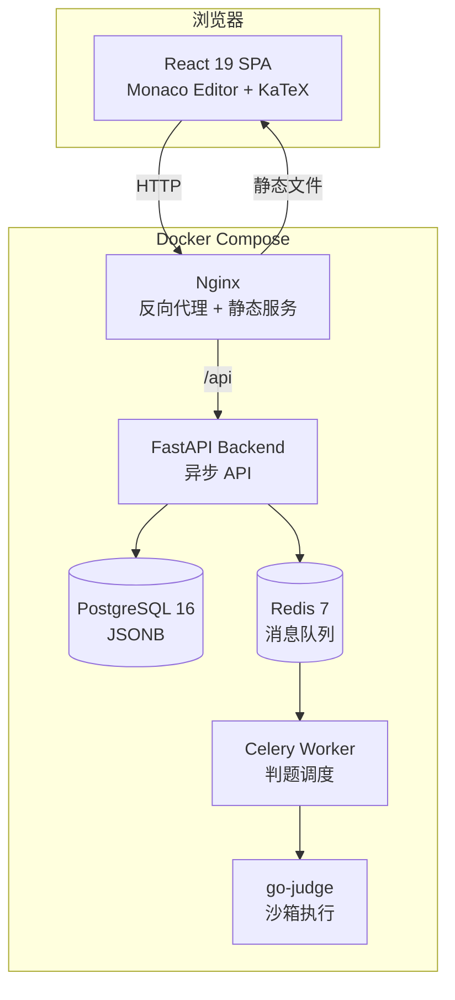

<div align="center">

# Mak's OJ

**面向 C++ 程序设计课程的全栈在线判题系统**

[](LICENSE)
[](https://react.dev/)
[](https://fastapi.tiangolo.com/)
[](https://www.typescriptlang.org/)
[](https://www.docker.com/)
[](https://www.postgresql.org/)

[在线演示](http://43.165.172.190/) · [问题反馈](https://github.com/MaiLexuan/mak-oj/issues)

</div>

---

## 项目简介

Mak's OJ 是一个为大学 C++ 课程设计的在线判题系统，注重**题目阅读体验**和**代码评测能力**。系统支持静态判题与 Fuzz 对拍双模式评测，前端采用 Monaco Editor 多文件编辑，题目页面支持 Markdown + KaTeX 数学公式渲染。

> 项目通过 Claude Code 迭代式人机协作完成开发。

---

## 核心功能

| 功能 | 说明 |
|------|------|
| **多文件代码编辑** | Monaco Editor 桌面端 / 移动端自适应，支持语法高亮、自动补全、多文件 Tab 切换 |
| **静态判题** | 编译 → 执行测试用例 → 对比标准输出，返回 AC / WA / CE / TLE / RE / MLE |
| **Fuzz 对拍** | 随机输入生成器 + 标准程序 vs 用户程序，10 轮差异对比 |
| **KaTeX 公式渲染** | 行内 `$...$` 与块级 `$$...$$` 数学公式渲染，覆盖分数、矩阵、积分等 |
| **在线自测** | Playground 模式，快速验证代码逻辑，不写入数据库 |
| **WA Diff 对比** | 逐字符 LCS Diff 展示期望输出 vs 实际输出 |
| **用户统计** | 提交次数、AC 率、做题分布图表 |
| **管理后台** | 题目 CRUD、测试用例管理、多文件模板、Fuzz 代码配置 |
| **双主题** | 亮色 / 暗色主题切换，暗色模式含 Aurora 背景与玻璃态特效 |

---

## 技术栈

<table>
<tr>
<td valign="top" width="50%">

**前端**

| 技术 | 用途 |
|------|------|
| React 19 + TypeScript 6 | UI 框架 |
| Vite 8 | 构建工具 |
| Tailwind CSS v4 + shadcn/ui | 样式方案 |
| Monaco Editor | 代码编辑器 |
| Zustand 5 | 状态管理 |
| Framer Motion 12 | 动画 |
| react-markdown + KaTeX | Markdown / 公式渲染 |
| recharts 3 | 统计图表 |

</td>
<td valign="top" width="50%">

**后端 & 基础设施**

| 技术 | 用途 |
|------|------|
| FastAPI (async) | Web 框架 |
| SQLAlchemy 2 + asyncpg | ORM + PostgreSQL 驱动 |
| PostgreSQL 16 | 数据库 (JSONB) |
| Redis 7 + Celery | 异步任务队列 |
| go-judge | 判题沙箱 |
| JWT + bcrypt | 认证与密码哈希 |
| Nginx | 反向代理 |
| Docker Compose | 容器编排 (6 服务) |

</td>
</tr>
</table>

---

## 系统架构



### 判题流程

```
静态判题：编译 → 逐用例执行 → 对比输出 → AC/WA/CE/TLE/RE/MLE
Fuzz 对拍：编译(user+gen+std) → 10轮: 生成随机输入 → std输出 vs user输出 → 差异对比
```

---

## 快速开始

### 环境要求

- Docker & Docker Compose
- Node.js >= 18（前端开发）
- Python >= 3.11（后端开发）

### 一键启动

```bash
git clone https://github.com/MaiLexuan/mak-oj.git
cd mak-oj

# 启动基础设施（PostgreSQL + Redis + go-judge）
docker compose up -d db redis judge-core

# 配置后端
cd backend
cp .env.example .env   # 编辑 .env 设置密码和密钥
pip install -r requirements.txt

# 启动后端
uvicorn main:app --reload --port 8000 &

# 启动判题 Worker
celery -A celery_app.celery worker --loglevel=info &

# 启动前端
cd ../frontend
npm install
npm run dev
```

访问 `http://localhost:5173`

### Docker Compose 全栈启动

```bash
# 确保已配置 backend/.env
docker compose up -d
```

访问 `http://localhost`

---

## 项目结构

```
.
├── frontend/                # React 19 + Vite 8 + TypeScript
│   └── src/
│       ├── components/      # UI 组件（工作台、编辑器、渲染器）
│       ├── pages/           # 页面（首页、工作台、登录、管理后台）
│       ├── store/           # Zustand 状态管理
│       ├── lib/             # 工具函数（API、Diff）
│       └── styles/          # 主题与样式
│
├── backend/                 # FastAPI + SQLAlchemy
│   ├── app/routers/         # API 路由（认证、题目、管理）
│   ├── routers/             # 提交评测、用户统计
│   ├── scripts/             # 数据管理工具
│   ├── worker.py            # Celery 判题 Worker
│   └── Dockerfile
│
├── docker-compose.yml       # 6 服务容器编排
├── nginx.conf               # Nginx 配置
├── PROBLEM_SPEC.md          # 题目数据规范
└── LICENSE
```

---

## 截图

> 待补充

---

## 贡献

欢迎提交 Issue 和 Pull Request。

1. Fork 本仓库
2. 创建功能分支 (`git checkout -b feature/amazing-feature`)
3. 提交更改 (`git commit -m 'feat: add amazing feature'`)
4. 推送到分支 (`git push origin feature/amazing-feature`)
5. 开启 Pull Request

---

## License

[MIT](LICENSE) © 2026 Mai Lexuan
